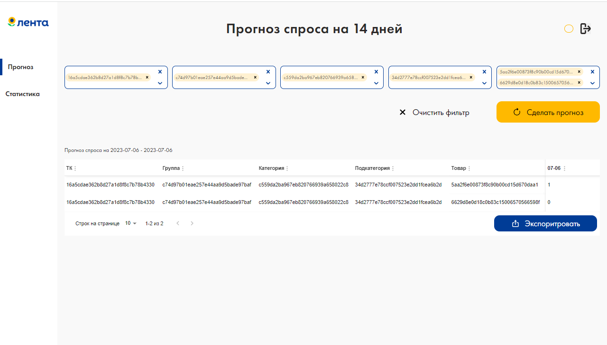

# Хакатон Yandex.Practicum x Lenta Frontend

## Команда
- [Виктор Кикодзе](https://github.com/vitland)
- [Андрей Юрченко](https://github.com/AndreiEth)

## Установка и запуск

`npm install`

`npm run dev`

## Технологии

- [React 18](https://react.dev/)
- [Typescript](https://www.typescriptlang.org/)
- [Redux Toolkit](https://redux-toolkit.js.org/)
- [Material React Table](https://www.material-react-table.com/)
- [React-select](https://react-select.com/home)
- [axios](https://axios-http.com/)
- [react-icons](https://react-icons.github.io/react-icons/)
- [mui](https://mui.com/material-ui/)
- [emotion](https://emotion.sh/docs/introduction)
- [classnames](https://www.npmjs.com/package/classnames)
- [Futura PT](https://www.cdnfonts.com/futura-pt.font)
